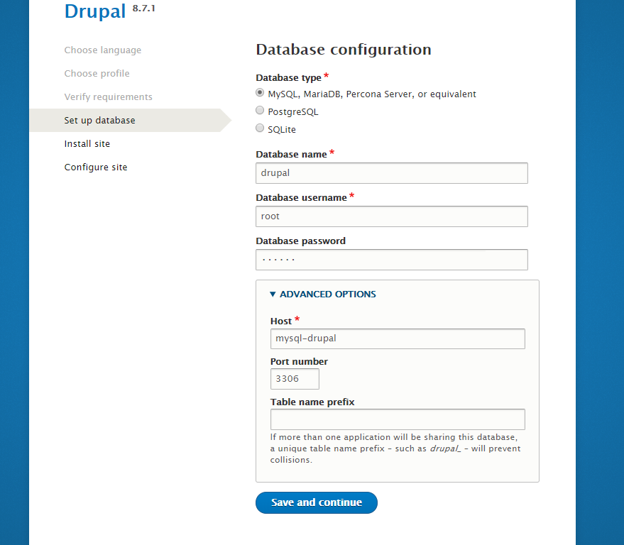

# LAMP-3

Here are tree LAMP'S with different containers, haproxy, Wordpress and Drupal

This branch create tree users that must be administrators to create
web content a wordpress and drupal platforms, 
so if you want to change the names of the users, change it 
in the script file and docker-compose.yml too 

You could help me by telling me how to make general variables, 
so there would not be so many changes

# Access to drupal

